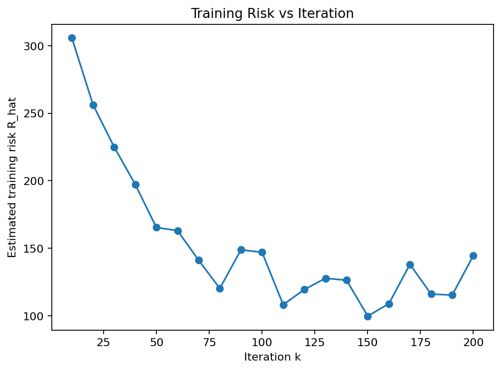

# MPI-SGD for NYC Taxi Fare (1-Hidden-Layer MLP)

## 1) Overview

This repository implements **mini-batch SGD** for a **1-hidden-layer MLP** under **MPI data parallelism**. Each MPI rank loads its own shard(s) of the dataset, computes local stochastic gradients, and synchronizes parameters via **all-reduce**.
 We report:

- Training **risk curves** estimated \(R_{\hat{}} vs iteration kk)
- **Test RMSE** (log scale and **USD**)
- **Training time vs #processes** (scaling)

> Artifacts (plots/CSVs) referenced below are based on **validated runs only** (bad/incomplete runs were filtered out).

------

## 2) Repository Structure & Scripts

- `mpi_train_save.py` — Core training; performs **global feature normalization** across ranks; supports `--target {amount, log}`; saves checkpoint (`.npz`) with model parameters and normalization stats/metadata for reproducible evaluation.
- `mpi_train_with_curve.py` — Training **plus** periodic logging of estimated training risk `R_hat` every `--curve_every` steps to a CSV/log. Includes optional **gradient clipping** on the **globally averaged** gradient and debug flags for gradient norms/parameter consistency.
- `mpi_eval_stream.py` — **Parallel** evaluation on test Parquet files. Restores feature (and, if `--target log`, target) normalization from the checkpoint; streams inference in batches; reduces SSE with Allreduce; prints **RMSE (log)** and **RMSE_USD** on rank 0.
- `run_grid.sh` — Activation × batch-size sweep (defaults: activations = `relu, tanh, sigmoid`; batch sizes = `256, 512, 1024, 2048, 4096`). Automates training + evaluation and writes a consolidated CSV (e.g., `results_grid.csv`) with parameters, runtime, and **RMSE_USD**.
- `run_timing.sh` — Benchmarks scaling vs number of processes (`np ∈ {1,2,4,8}` by default). Sets `OMP_NUM_THREADS=1` to avoid BLAS over-parallelism; conditionally adds `--oversubscribe` / `--use-hwthread-cpus` if helpful. Produces a timing CSV (e.g., `results_timing.csv`) and per-np logs.

------

## 3) Environment & Dependencies

- OS: Linux / WSL2 recommended
- Python: 3.10+
- MPI: MPICH or OpenMPI (with `mpirun`)
- Python packages: `numpy`, `pandas`, `pyarrow`, `mpi4py`

Setup:

```bash
python -m venv venv
source venv/bin/activate                 # Windows: venv\Scripts\activate
pip install -r requirements.txt          # or pip install numpy pandas pyarrow mpi4py
mpirun -n 2 python -c "from mpi4py import MPI; print(MPI.COMM_WORLD.Get_rank())"
```

------

## 4) Data

- **Train directory**: `$TRAIN_DIR` (Parquet files)
- **Test directory**: `$TEST_DIR` (Parquet files)
- **Target column**: `total_amount`
   When `--target log`, the pipeline saves/uses target mean/std to ensure consistent evaluation.

> Each rank reads its own shard(s); only **gradients/parameters** are communicated. Full datasets are **not** broadcast between ranks.

------

## 5) Quick Start

### 5.1 Train & Save

```bash
mpirun -np 4 python -u mpi_train_save.py \
  --data_dir "$TRAIN_DIR" \
  --target log \
  --hidden 128 \
  --activation relu \        # relu | tanh | sigmoid
  --batch 1024 \
  --epochs 4 \
  --lr 1e-3 \
  --clip 5 \
  --max_steps_per_epoch 200 \
  --save_path ckpts/taxi_sgd_log_relu_h128_b1024_ep4.npz
```

### 5.2 Train With Risk Curve Logging

```bash
mpirun -np 4 python -u mpi_train_with_curve.py \
  --data_dir "$TRAIN_DIR" \
  --target amount \
  --hidden 128 --activation relu \
  --batch 1024 --epochs 4 --lr 1e-3 --clip 5 \
  --max_steps_per_epoch 200 \
  --curve_every 20 \
  --curve_log logs/train_curve.csv \
  --save_path ckpts/taxi_relu_h128_b1024_ep4.npz
```

### 5.3 Evaluate (Compute RMSE)

```bash
mpirun -np 4 python -u mpi_eval_stream.py \
  --test_dir "$TEST_DIR" \
  --ckpt ckpts/taxi_sgd_log_relu_h128_b1024_ep4.npz \
  --batch 16384 \
  --progress_every_files 5
```

### 5.4 Grid & Timing

```bash
bash run_grid.sh    # activation × batch sweep; writes results_grid.csv
bash run_timing.sh  # np in {1,2,4,8}; writes results_timing.csv
```

You can run the scripts either way:
- `bash run_grid.sh`        # no execute bit needed; forces bash
- `chmod +x run_grid.sh && ./run_grid.sh`  # uses the script's shebang

If you see `Permission denied`, run `chmod +x <script>`.
If you see `Exec format error` on Linux/WSL, ensure the file has LF line endings (e.g., `sed -i 's/\r$//' run_grid.sh`) and the shebang is present:`#!/usr/bin/env bash`.

------

## 6) What to Submit / Report

- **Hyperparameters** per run (activation, batch, hidden, lr, epochs, etc.)
- **Training curves** estimated \(R_{\hat{}} vs iteration kk)
- **RMSE** on **train/test** (highlight **RMSE_USD**)
- **Training time vs #processes** (scaling/efficiency analysis)
- Any attempts to improve performance (feature engineering, normalization, learning rate, clipping, initialization, etc.)

------

## 7) Results (based on the retained artifacts)

### 7.1 Training Curves (Estimated Risk R^R_{\hat{}})

We report the training risk as a function of the iteration index kk. The retained figure and CSVs are:

- **Figure**: `figures/train_curve_20250925T091342Z.png`
- **Tables**:
  - `tables/train_curve_20250925T091342Z.csv`
  - `tables/train_curve_ep4_k50.csv`

**Observation.** The curve shows a rapid decrease during early iterations followed by a mild oscillatory plateau—typical mini-batch SGD behavior with a fixed learning rate—and no signs of divergence.

**How to regenerate.** Re-run `mpi_train_with_curve.py` with `--curve_every` and `--curve_log` enabled; plot from either CSV using your preferred notebook or plotting script.

```markdown

```

------

### 7.2 RMSE Summary (Activation × Batch)

Final evaluation metrics are consolidated in:

- **Table**: `tables/results_grid.csv`

This CSV contains the configuration (activation, batch size, hidden units, etc.), runtime fields, and the **test RMSE in USD** for each run. Use it directly to build the RMSE table in your report; no additional logs are required.

------

### 7.3 Parallel Timing / Scaling

The scaling experiment results are consolidated in:

- **Table**: `tables/results_timing.csv`

This CSV records wall-clock training time versus number of processes np\texttt{np}. Use it to compute speedup/efficiency if needed (e.g., speedup =T1/Tp= T_{1}/T_{p}, efficiency =speedup/p= \text{speedup}/p).

------

## 8) Notes & Implementation Details

- **Data parallelism.** Each MPI rank samples mini-batches from its local shard; gradients are averaged via Allreduce. Full datasets are not broadcast between ranks.
- **Normalization & checkpoints.** Global feature (and, if `--target log`, target) mean/std are saved in the checkpoint and restored at evaluation time to ensure train/test consistency.
- **Gradient clipping.** (If enabled) clipping is applied to the **globally averaged** gradient to stabilize updates under large batches.
- **Numerical stability.** If using `sigmoid`, consider stronger input scaling or a smaller learning rate to avoid `exp` overflows; `relu` is generally the most stable choice here.
- **Scaling hygiene.** For timing, set `OMP_NUM_THREADS=1` to prevent BLAS over-parallelism; match `np` to physical cores; increase per-epoch work (`--max_steps_per_epoch`) to better amortize communication.

------

## 9) Reproducibility

This section documents exactly how to reproduce the **four CSVs** in `tables/` and the **single curve image** in `figures/`.

### 9.1 Environment

- Python 3.10+; MPICH/OpenMPI with `mpirun`
- `pip install -r requirements.txt`
- Set `OMP_NUM_THREADS=1` for timing/scaling runs.

### 9.2 Determinism

- Use a fixed random seed (e.g., `--seed 42`) for all training/evaluation runs.
- The evaluator restores feature (and, if `--target log`, target) normalization from the checkpoint to ensure the same RMSE as training.

### 9.3 Reproducing the training curves

Artifacts:

- **Figure:** `figures/train_curve_20250925T091342Z.png`
- **Tables:** `tables/train_curve_20250925T091342Z.csv`, `tables/train_curve_ep4_k50.csv`

Steps:

1. Run training **with curve logging**:

   ```bash
   mpirun -np 4 python -u mpi_train_with_curve.py \
     --data_dir "$TRAIN_DIR" \
     --target amount \
     --hidden 128 --activation relu \
     --batch 1024 --epochs 4 --lr 1e-3 --clip 5 \
     --max_steps_per_epoch 200 \
     --curve_every 20 \
     --curve_log tables/train_curve_20250925T091342Z.csv \
     --save_path ckpts/taxi_relu_h128_b1024_ep4.npz \
     --seed 42
   ```

2. Plot the curve from the CSV using your preferred plotting script/notebook and save as
    `figures/train_curve_20250925T091342Z.png`.

3. (Optional) If you want a shorter curve for illustration, you can re-run and export to
    `tables/train_curve_ep4_k50.csv` with fewer recorded points (e.g., `--curve_every` larger).

### 9.4 Reproducing the RMSE grid table

Artifact:

- **Table:** `tables/results_grid.csv`

Steps (runs the activation × batch sweep and evaluates each run):

```bash
bash run_grid.sh
# Copy or move the produced CSV to: tables/results_grid.csv
```

Notes:

- The script trains with your default hidden size/epochs/LR and evaluates RMSE on the test set.
- Ensure `--target` and normalization settings match between training and evaluation.

### 9.5 Reproducing the timing/scaling table

Artifact:

- **Table:** `tables/results_timing.csv`

Steps:

```bash
bash run_timing.sh
# Copy or move the produced CSV to: tables/results_timing.csv
```

Guidelines:

- Keep `OMP_NUM_THREADS=1`.
- Match `np` to physical cores where possible.
- Use consistent data directory and hyperparameters to make timings comparable.

### 9.6 Minimal deliverable layout (what this README references)

```
.
├─ README.md
├─ requirements.txt
├─ mpi_train_save.py
├─ mpi_train_with_curve.py
├─ mpi_eval_stream.py
├─ run_grid.sh
├─ run_timing.sh
├─ figures/
│  └─ train_curve_20250925T091342Z.png
└─ tables/
   ├─ results_grid.csv
   ├─ results_timing.csv
   ├─ train_curve_20250925T091342Z.csv
   └─ train_curve_ep4_k50.csv
```

------

## 10) Troubleshooting

- **`mpi4py` not found:** Ensure MPI is installed first; activate the venv; `pip install mpi4py`.
- **Hangs across nodes:** Check SSH/firewall/hostfiles; for MPICH ensure proper interface env (`HYDRA_IFACE`); for OpenMPI consider `--mca` flags as needed.
- **OOM / slow I/O:** Reduce `--batch`; stream Parquet in larger row groups; avoid pandas materializing full tables per rank.
- **Datetime/feature mismatch:** Ensure test features match the features saved in the checkpoint (`feat_cols`); the evaluator will error on mismatch.

------

## 11) AI Tool Declaration

I used **ChatGPT (GPT-5 Thinking)** to help structure the README, filter noisy logs, and summarize figures/CSVs from **validated** runs only. All code execution and experimental results were produced and verified by the authors.

